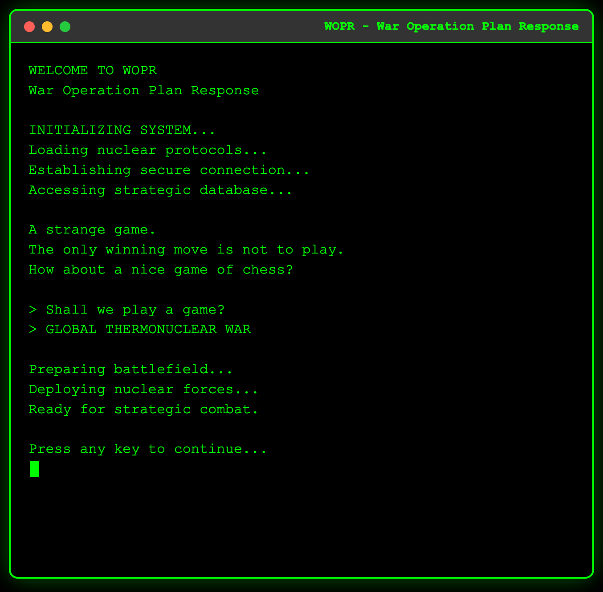

# Global Thermonuclear War

[](http://creativecommons.org/licenses/by-nc-sa/4.0/)

> **Note:** This project exists because I wanted to see what [**Cursor**](https://cursor.com/) could do. Friends tossed out ideas on Discord, and this is what stuck—so here we are. The game didn’t *need* to exist, but it does now, so I wanted to make it publicly playable.  

A retro-styled, web-based “chess-like” game loosely inspired by *WarGames* and its infamous “Global Thermonuclear War.” You can take on the role of the United States or the Soviet Union, battling it out with nuclear pieces on a terminal-styled board. 


<!-- Updated screenshot -->

## 🎮 Play Now  

Play it here: [**Global Thermonuclear War on GitHub Pages**](https://femmexfmr.github.io/global-thermonuclear-war/)  

## ✨ Features

- **Retro Terminal UI**: Authentic 1983 WarGames aesthetic with green-on-black terminal styling
- **Strategic Gameplay**: Chess-like mechanics with nuclear war theme
- **Two Game Modes**: Human vs Human or Human vs Computer
- **Authentic Pieces**: ICBMs, bombers, submarines, missile silos, and more
- **Animated Effects**: Typewriter text, nuclear explosions, and victory animations
- **Responsive Design**: Works on desktop and mobile devices
- **No Dependencies**: Pure HTML, CSS, and JavaScript - no frameworks required

## 🚀 Quick Start

### Local Development

1. **Clone the repository**:
   ```bash
   git clone https://github.com/yourusername/global-thermonuclear-war.git
   cd global-thermonuclear-war
   ```

2. **Start a local server**:
   ```bash
   # Using Python 3
   python3 -m http.server 8000
   
   # Using Node.js (if you have http-server installed)
   npx http-server
   
   # Using PHP
   php -S localhost:8000
   ```

3. **Open your browser**:
   Navigate to `http://localhost:8000`

### Deploy to Web

Simply upload the files to any web hosting service:
- **GitHub Pages**: Push to a GitHub repository and enable Pages
- **Netlify**: Drag and drop the folder to Netlify
- **Vercel**: Connect your GitHub repository
- **Any static hosting**: Upload `index.html`, `styles.css`, and `game.js`

## 🎯 How to Play

### Objective
Capture the enemy's command center (Pentagon/Kremlin) or eliminate all enemy pieces to achieve nuclear superiority.

### Game Pieces

#### US Forces (Blue)
- 🚀 **ICBM**: Intercontinental Ballistic Missile (moves like rook)
- ✈️ **B-52**: Strategic Bomber (moves like queen)
- 🚢 **SUB**: Nuclear Submarine (moves like knight)
- 🏗️ **SILO**: Missile Silo (moves like king)
- 🏛️ **PENT**: Pentagon Command (moves like king)
- 🛡️ **ABM**: Anti-Ballistic Missile (moves like bishop)
- 🛰️ **SAT**: Reconnaissance Satellite (moves like rook)
- 👨‍✈️ **GEN**: General (moves like king)

#### USSR Forces (Red)
- 🚀 **ICBM**: Intercontinental Ballistic Missile (moves like rook)
- ✈️ **TU-95**: Strategic Bomber (moves like queen)
- 🚢 **SUB**: Nuclear Submarine (moves like knight)
- 🏗️ **SILO**: Missile Silo (moves like king)
- 🏛️ **KREML**: Kremlin Command (moves like king)
- 🛡️ **ABM**: Anti-Ballistic Missile (moves like bishop)
- 🛰️ **SAT**: Reconnaissance Satellite (moves like rook)
- 👨‍✈️ **GEN**: General (moves like king)

### Controls
1. **Click** on your piece to select it
2. **Click** on a valid destination square to move
3. **Capture** enemy pieces by moving to their square
4. **Protect** your command center at all costs!

## 🛠️ Technical Details

- **Framework**: Pure HTML5, CSS3, and ES6 JavaScript
- **Styling**: Custom CSS with retro terminal aesthetics
- **AI**: Simple but effective computer opponent
- **Responsive**: Mobile-friendly design
- **Performance**: Lightweight and fast loading
- **Browser Support**: Modern browsers (Chrome, Firefox, Safari, Edge)

## 📁 Project Structure

```
global-thermonuclear-war-web/
├── index.html          # Main HTML file
├── styles.css          # All CSS styling
├── game.js            # Game logic and AI
├── README.md          # This file
└── .gitignore         # Git ignore rules
```

## 🎨 Customization

### Changing Colors
Edit `styles.css` to modify the color scheme:
```css
:root {
  --primary-color: #00ff00;    /* Terminal green */
  --background-color: #000000; /* Black background */
  --accent-color: #ff6b6b;     /* Red accent */
}
```

### Adding New Pieces
Modify the `pieces` object in `game.js`:
```javascript
'NEW_PIECE': { icon: '🔥', label: 'FIRE', color: '#ff0000' }
```

### Adjusting AI Difficulty
Modify the scoring system in the `computerMove()` function in `game.js`.

## 🤝 Contributing

1. Fork the repository
2. Create a feature branch (`git checkout -b feature/amazing-feature`)
3. Commit your changes (`git commit -m 'Add amazing feature'`)
4. Push to the branch (`git push origin feature/amazing-feature`)
5. Open a Pull Request

## 📄 License

This project is licensed under the Creative Commons Attribution-NonCommercial-ShareAlike 4.0 International License - see the [LICENSE](LICENSE) file for details.

## 🙏 Acknowledgments

- Inspired by the classic 1983 movie "WarGames"
- Original Global Thermonuclear War game concept
- Terminal aesthetics inspired by 1980s computer interfaces
- Chess rules adapted for nuclear warfare theme
- Completely written with [**Cursor**](https://cursor.com/)

## 🎬 Movie Quote

> "A strange game. The only winning move is not to play." - Joshua (WarGames, 1983)

---

**Ready to play?** [Start your nuclear war!](https://femmexfmr.github.io/global-thermonuclear-war) 🚀💥
